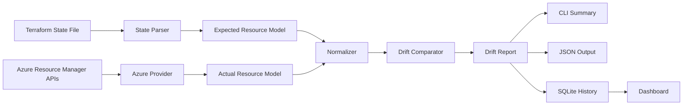
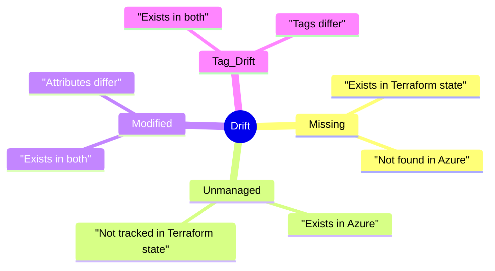
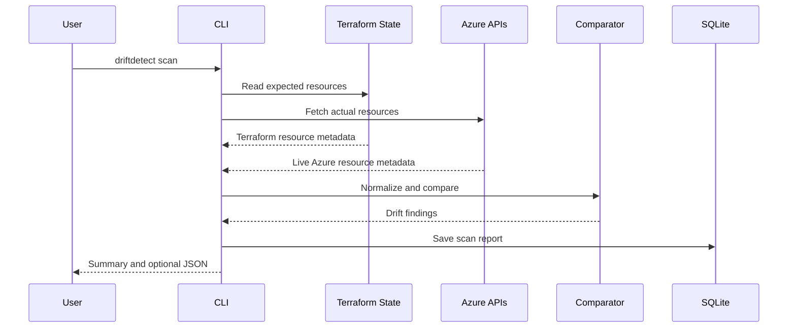

# Terraform Drift Detector

An Azure-first platform for detecting infrastructure drift by comparing Terraform state files with live cloud resources, without running `terraform plan` or `terraform apply`.

The project is built as a lightweight, cloud-agnostic foundation: Azure is implemented first, and the provider interface is ready for AWS, GCP, or private cloud integrations later.

## What It Solves

Infrastructure drift happens when live cloud resources no longer match the infrastructure Terraform believes it manages.

Common examples:

- A resource was deleted manually in Azure.
- Tags were changed outside Terraform.
- A storage account, network, or vault setting changed in the portal.
- A live Azure resource exists but is not tracked in Terraform state.

This tool gives fast visibility into that drift directly from Terraform state and cloud provider APIs.



## Core Capabilities

| Capability | Status | Description |
| --- | --- | --- |
| Terraform state parsing | Implemented | Reads local `.tfstate` files and extracts managed Azure resources. |
| Azure resource inventory | Implemented | Uses Azure SDK and `DefaultAzureCredential` to read live resources. |
| Offline inventory mode | Implemented | Compares state against a captured JSON resource inventory for tests or demos. |
| Normalized model | Implemented | Converts Terraform and Azure resource shapes into one common format. |
| Drift comparison | Implemented | Finds missing, unmanaged, modified, and tag drift. |
| JSON reports | Implemented | Writes structured scan output for automation. |
| SQLite history | Implemented | Stores scan history locally. |
| Dashboard | Implemented | Serves a simple local report dashboard. |
| Scheduler | Implemented | Runs scans repeatedly from the CLI process. |
| Cloud-agnostic providers | Foundation ready | Azure exists now; AWS/GCP can plug into the provider interface. |

## Drift Types



| Drift Type | Meaning |
| --- | --- |
| `missing` | Terraform state expects the resource, but Azure no longer has it. |
| `unmanaged` | Azure has the resource, but Terraform state does not track it. |
| `modified` | The resource exists in both places, but normalized properties differ. |
| `tag_drift` | The resource exists in both places, but tags differ. |

## Repository Layout

```text
terraform_drift_detector/
  cli.py              # scan, schedule, and serve commands
  scanner.py          # end-to-end scan orchestration
  state_parser.py     # Terraform state reader
  providers.py        # Azure and fixture providers
  normalizers.py      # Terraform/Azure common model conversion
  comparator.py       # drift detection engine
  models.py           # normalized resources and report models
  storage.py          # SQLite scan storage
  dashboard.py        # FastAPI dashboard

examples/
  terraform.tfstate   # sample expected state
  azure-resources.json # sample actual Azure inventory

tests/
  test_comparator.py
  test_state_parser.py
```

## How Scanning Works



## Requirements

- Python 3.10 or newer
- Terraform state file
- Azure credentials for live Azure scans

Optional:

- Azure SDK dependencies for live Azure scans
- Dashboard dependencies for local web UI
- Pytest for running tests

## Installation

Install the core package:

```powershell
pip install -e .
```

Install Azure support:

```powershell
pip install -e .[azure]
```

Install dashboard support:

```powershell
pip install -e .[dashboard]
```

Install development tools:

```powershell
pip install -e .[dev,dashboard,azure]
```

## Azure Authentication

The Azure provider uses `DefaultAzureCredential`, so it supports the normal Azure identity chain.

Local development:

```powershell
az login
```

Service principal:

```powershell
$env:AZURE_CLIENT_ID = "<client-id>"
$env:AZURE_TENANT_ID = "<tenant-id>"
$env:AZURE_CLIENT_SECRET = "<client-secret>"
$env:AZURE_SUBSCRIPTION_ID = "<subscription-id>"
```

Managed identity is also supported when running in Azure-hosted environments.

## Run A Live Azure Scan

```powershell
driftdetect scan `
  --state .\terraform.tfstate `
  --provider azure `
  --subscription-id <subscription-id>
```

Write a JSON report:

```powershell
driftdetect scan `
  --state .\terraform.tfstate `
  --subscription-id <subscription-id> `
  --output .\report.json
```

Expected CLI summary:

```text
Scan 6f8ff873-2bbf-4708-982c-e532ca1a32cf completed for azure
Expected=2 Actual=3 Missing=0 Modified=1 TagDrift=1 Unmanaged=1
```

## Run Offline With Sample Data

The repository includes a sample Terraform state file and a sample Azure inventory file. This is useful for demos, tests, and local validation without Azure credentials.

```powershell
python -m terraform_drift_detector.cli scan `
  --state examples\terraform.tfstate `
  --actual examples\azure-resources.json `
  --output examples\report.json `
  --db examples\drift.db
```

## JSON Report Shape

```json
{
  "scan_id": "6f8ff873-2bbf-4708-982c-e532ca1a32cf",
  "provider": "azure",
  "started_at": "2026-06-13T10:00:00+00:00",
  "completed_at": "2026-06-13T10:00:02+00:00",
  "summary": {
    "total_expected": 2,
    "total_actual": 3,
    "missing": 0,
    "unmanaged": 1,
    "modified": 1,
    "tag_drift": 1
  },
  "findings": [
    {
      "kind": "tag_drift",
      "resource_id": "/subscriptions/.../resourceGroups/rg-prod",
      "resource_type": "Microsoft.Resources/resourceGroups",
      "name": "rg-prod",
      "terraform_address": "azurerm_resource_group.main",
      "diffs": [
        {
          "path": "tags.env",
          "expected": "prod",
          "actual": "production"
        }
      ]
    }
  ]
}
```

## Dashboard

Start the local dashboard:

```powershell
driftdetect serve --db .\drift.db --host 127.0.0.1 --port 8000
```

Open:

```text
http://127.0.0.1:8000
```

Dashboard endpoints:

| Endpoint | Description |
| --- | --- |
| `/` | Simple dashboard UI |
| `/api/latest` | Latest full scan report |
| `/api/scans` | Recent scan history |

## Scheduled Scans

Run scans repeatedly in the current process:

```powershell
driftdetect schedule `
  --state .\terraform.tfstate `
  --subscription-id <subscription-id> `
  --every 30m `
  --db .\drift.db
```

Supported interval suffixes:

| Suffix | Meaning |
| --- | --- |
| `s` | Seconds |
| `m` | Minutes |
| `h` | Hours |

## Extending To More Clouds

The provider boundary is intentionally small:

```python
class CloudProvider(ABC):
    name: str

    @abstractmethod
    def list_resources(self) -> list[NormalizedResource]:
        raise NotImplementedError
```

To add another cloud:

1. Implement a provider that fetches live resources.
2. Normalize those resources into `NormalizedResource`.
3. Add provider selection in the CLI.
4. Add provider-specific tests and sample fixtures.

## Development

Run syntax checks:

```powershell
python -m compileall terraform_drift_detector tests
```

Run tests:

```powershell
python -m pytest -q
```

Run the sample scan:

```powershell
python -m terraform_drift_detector.cli scan `
  --state examples\terraform.tfstate `
  --actual examples\azure-resources.json
```

## Design Notes

- Terraform state is treated as the expected source of truth.
- Terraform configuration is not evaluated.
- Terraform commands are not required during scanning.
- Dynamic cloud metadata such as IDs, etags, provisioning state, and location noise are normalized or ignored where appropriate.
- Reports are JSON-first so they can be used by CI/CD, dashboards, or alerting systems.

